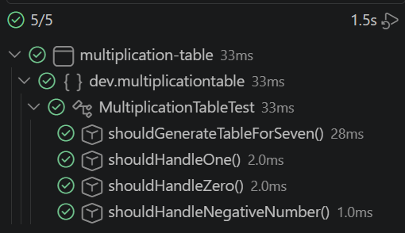
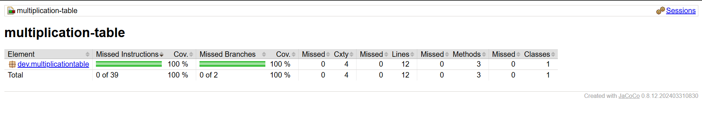

# Multiplication Table

## 📝 Descripción

Ejercicio que consiste en crear una clase Java que genere la tabla de multiplicar de un número entero (del 1 al 10), con tests unitarios y cobertura mínima del 70%.

Dado un número entero `n`, la clase `MultiplicationTable` genera sus 10 primeros múltiplos, en el formato: n x i = resultado

Ejemplo, para `n = 7`:

```
7 x 1 = 7
7 x 2 = 14
7 x 3 = 21
7 x 4 = 28
7 x 5 = 35
7 x 6 = 42
7 x 7 = 49
7 x 8 = 56
7 x 9 = 63
7 x 10 = 70
```

### 💻 Tecnologías utilizadas

* Java 21
* Maven
* JUnit 5 (Jupiter)
* JaCoCo (cobertura de tests)

---

## 📁 Estructura de carpetas

```
src/
├── assets/
│ ├── tests-coverage.png
│ └── tests-verde.png
├── main/java/dev/multiplicationtable/MultiplicationTable.java
└── test/java/dev/multiplicationtable/MultiplicationTableTest.java
pom.xml
.gitignore
README.md

```

## 📦 Cómo ejecutar

Compilar el proyecto:

```bash
mvn clean compile
```

Ejecutar los tests:

```bash
mvn clean test
```

---

## ✅ Cobertura de tests

El informe de JaCoCo se genera en `target/site/jacoco/index.html` tras ejecutar `mvn clean test`. Cobertura actual: **84%** (mínimo exigido: 70%).

---

## 📷 Capturas

### Tests en verde



### Cobertura de tests (100%)



---

## ✍️ Autora

duran-ni